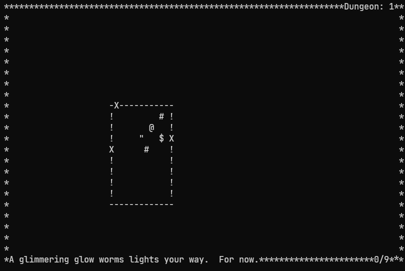

# Roguia


[](https://www.python.org/)
[](https://www.tensorflow.org/?hl=fr)
[](https://github.com/RaykeshR/PFE-Roguelike)
[](https://git-scm.com/)
[](https://fr.wikibooks.org/wiki/Programmation_Bash/Scripts)
[](https://docs.github.com/fr/get-started/writing-on-github/getting-started-with-writing-and-formatting-on-github/basic-writing-and-formatting-syntax)
[](https://code.visualstudio.com/)
[](https://learn.microsoft.com/fr-fr/powershell/scripting/overview?view=powershell-7.4)
[](https://www.microsoft.com/fr-fr/windows?r=1)

Le site est accessible via ce [Lien qui fait une Redirection d'URL](https://raykeshr.github.io/PFE-Roguelike/) vers une page d'accueil pour le site du Github : PFE-Roguelike
Note de Travail : [Fichier Word](https://raykeshr.github.io/PFE-Roguelike/Word_Redirection.html) <!-- si ça ne marche pas cliquer ici : [Fichier Word](https://reseaueseo-my.sharepoint.com/:w:/r/personal/sabri_messaoudi_reseau_eseo_fr/Documents/Note%20de%20Travail%20PFE.docx?d=w94d9488edfa142df962016daa36a74ba&csf=1&web=1&e=UM8vt7) -->


#### Sommaire 

TODO :octocat: :neckbeard: :bowtie: :shipit:

### Introduction au projet PFE-Roguelike :

[
](https://fr.wikipedia.org/wiki/Roguelike)

### Le poster de Roguia :

TODO :octocat:  :shipit:
[

]()

### Mise en place (Windows):

<!-- <details open> -->
<details>
<summary>Création d'environnements virtuels : </summary>

## Un package manquant : 
<!-- !!!!!!!!!!!!!!!!!!!!!!!!!!!!!!!!!!!!!!!!!!!!!!!!!!!!!!!!!!!!!!!!!!!!!!!!!!!!!!!!!!!!!!!!!!!!!!!!!!!!!!!!!!!!!!!!!!!!!!!!!!!!!!!!!!!!!!!!!!!!!!!!!!!!!!! -->
```
.venv\Scripts\activate && python -m pip install --upgrade pip && python -m pip install -r requirements.txt
```

### 1. Cloner le Repo

avec GitHub (Copie les fichiers localement)

### 2. `python -m venv .venv`

peut nécessiter le passage par CMD (Crée le Dossier .venv)

### 3. `.venv\Scripts\activate`
 

Créer un environnement virtuel Python (Sur Linux/Mac) :
```bash
source venv/bin/activate  # Sur Linux/Mac
```

Lancer avec le CMD peut éviter les erreurs. (Lance l'environnement virtuel)
EN ADMIN : `Set-ExecutionPolicy -ExecutionPolicy RemoteSigned` en cas d'erreur
([détail](https://tutorial.djangogirls.org/fr/django_installation/))

Résultat : 

$\color{rgba(100,255,100, 0.75)}{\textsf{(.venv)}}$ PS C:\Users...\Portfolio_Django> |

On peut aussi (Si c'est un problème de l'éditeur) `$ . .venv\Scripts\activate.ps1`
(lance l'environnement virtuel)

### 4. `python -m pip install --upgrade pip`

(met à jour pip)

### 5. `python -m pip install -r requirements.txt`

```pip freeze > requirements.txt``` pour remplir automatiquement les requirements

Pour toutes les étapes précédentes (sur CMD ou powershell>=7) : 


```
python -m venv .venv && .venv\Scripts\activate && python -m pip install --upgrade pip && python -m pip install -r requirements.txt
```

en cas d'erreur (supprimer le dossier .venv ou lancer): 

```.venv\Scripts\activate && python -m pip install --upgrade pip && python -m pip install -r requirements.txt```

Avec  pip freeze  :

    Pour toutes les étapes précédentes (sur CMD ou powershell>=7) : 
    ```python -m venv .venv && .venv\Scripts\activate && python -m pip install --upgrade pip && python -m pip install -r requirements.txt && pip freeze > requirements.txt```
    
    en cas d'erreur (supprimer le dossier .venv ou lancer): 
    ```.venv\Scripts\activate && python -m pip install --upgrade pip && python -m pip install -r requirements.txt && pip freeze > requirements.txt```
    
### 6. Modifier .git\info\exclude 

Ajouter : `.venv`
(Ne prend pas en compte la modification du dossier .venv)

### 7. Lancer le fichier main.py 

Commande : `python main.py `
(Lance le fichier principal avec python)

### Linux/Mac :

"""
python3 -m venv .venv
source .venv/bin/activate
python -m pip install --upgrade pip
python -m pip install -r requirements.txt
python main.py
"""
Modifier .git\info\exclude 

</details> 

<details>
<summary>Nettoyer un dépôt git : </summary>
Télécharger BFG Repo-Cleaner sur le site (.jar): 
https://rtyley.github.io/bfg-repo-cleaner/

Lancer : 

git clone --mirror https://github.com/RaykeshR/PFE-Roguelike.git
cd PFE-Roguelike.git
<!-- java -jar ../bfg-1.15.0.jar --delete-files database/.env -->
java -jar ../bfg-1.15.0.jar --delete-files .env

git reflog expire --expire=now --all
git gc --prune=now --aggressive
git push --force --all
git push --force --tags

<!-- git push --force origin Dev -->

<!-- git push --force origin --all
git push --force origin --tags -->

git push --mirror

</details> 

<details>
<summary>Création de l'exécutable (pour le déploiement) :</summary>

### Introduction

Pour distribuer l'application en tant que programme autonome sur Windows, nous utilisons `PyInstaller`. (Pour avoir une version compilé) Le processus est configuré via les fichiers `build.spec`, `PFERoguelike.spec` et `Roguia.spec` pour garantir que toutes les ressources nécessaires (images, données, etc.) sont incluses.

### Prérequis

1.  **PyInstaller** : Assurez-vous qu'il est installé. Il est inclus dans le `requirements.txt`.
```bash
python -m pip install pyinstaller
# OU       (pour mettre à jour l'environement virtuelle)
python -m venv .venv && .venv\Scripts\activate && python -m pip install --upgrade pip && python -m pip install -r requirements.txt
```

2.  **Résolution d'un conflit potentiel** : `PyInstaller` peut entrer en conflit avec une ancienne version du paquet `typing`. Si vous rencontrez une erreur à ce sujet lors de la compilation, vous devrez supprimer manuellement les fichiers correspondants de votre environnement virtuel :
    *   Supprimez le fichier : `.venv\Lib\site-packages\typing.py`
    *   Supprimez le dossier : `.venv\Lib\site-packages\typing-X.X.X.dist-info` (la version peut varier)


> [!NOTE]  
> Juste faire un `python -m pip uninstall typing` (sera retier/résolue dans le future)

### Compilation

Une fois les prérequis satisfaits, lancez la compilation avec la commande suivante à la racine du projet :

La version OneFolder (avec CLI)
```bash
pyinstaller build.spec
```
La version OneFile (avec CLI)
```bash
pyinstaller PFERoguelike.spec
```
La version OneFile (sans CLI)
```bash
pyinstaller Roguia.spec
```

### Résultat

Le résultat de la compilation se trouvera dans le dossier `dist/`. Vous y trouverez un sous-dossier `PFE-Roguelike` contenant l'exécutable `PFE-Roguelike.exe` ainsi que toutes ses dépendances.

Pour que l'application fonctionne, n'oubliez pas de placer le fichier de configuration `.env` à côté de l'exécutable (ou de configurer les variables d'environnement sur le système cible).
```bash
cd ./dist/PFE-Roguelike && ./PFE-Roguelike.exe ; cd ../..
```
<div style="background-color: #e7f3fe00; border-left: 4px solid #2196F3; padding: 10px; margin: 10px 0;">
<strong>Note</strong> :
faire un `.\dist\PFE-Roguelike\PFE-Roguelike.exe` Ne fonctione Pas ! ! ! (Le .env est mal chargée et le pool ne ce crée pas) 
Double Clicker sur le .exe marche néanmoins.
</div>


</details>

<br>

<details>
<summary>Autre : </summary>
<details>
<summary>Gemini-cli : </summary>
1. ouvrir un terminal (WSL, ...)
2. taper : `npm install -g @google/gemini-cli` / `sudo npm install -g @google/gemini-cli`
3. Changer de dossier : `cd .../PFE-Roguelike`
4. lancer gemini : avec `gemini`
5. login avec google
6. tester avec une question
7. lancer la commande : `/init`
    
</details> 
<details>
<summary>Gemini-cli + MCP Github : </summary>

Le Model Context Protocol (MCP) est un protocole standard ouvert conçu pour connecter des modèles d'intelligence artificielle (IA) (LLM, ...)
Ici, le MCP Github permettra à gemini d'accéder aux code source sans passer par une recherche web à chaque fois.

1. ouvrir un terminal (WSL, ...)
2. taper : `cd ~/.gemini`
3. modifier le fichier settings.json et ajouter au json : 
```
    , 
    "mcpServers": {
        "github": {
            "httpUrl": "https://api.githubcopilot.com/mcp/",
            "headers": {
                    "Authorization": "Bearer ghp_..."
                },
                "timeout": 5000
        }
    }

```    

> [!NOTE]  
> Pour obtenir le "Bearer ghp_..." ou plus précisément le `ghp_...` il faut mettre un PAT ( Personal access tokens (classic) : [https://github.com/settings/tokens](https://github.com/settings/tokens) ) nommé de préférence "Gemini MCP" avec les droits voulus.

</details> 

</details> 
